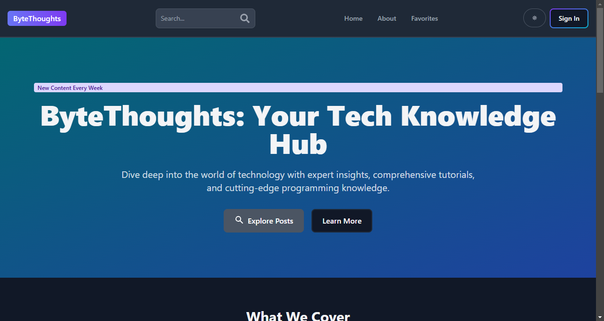
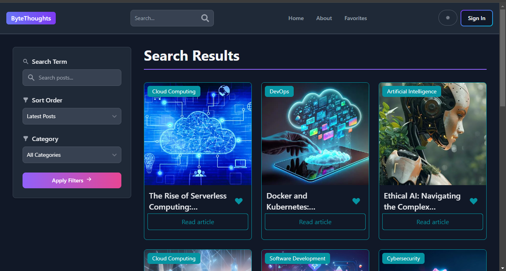

# 📝 ByteThoughts MERN Blog 🌐

A full-stack blogging platform that brings your thoughts to life! 🚀 Built with the powerful MERN stack (MongoDB, Express.js, React, Node.js), this application offers a seamless blogging experience for users and robust management tools for admins.

## 🎥 Tutorial Credit

This project was developed following the tutorial by **React & Next js Projects with Sahand**:
- **Tutorial Video:** [MERN Blog Application Full Tutorial](https://youtu.be/Kkht2mwSL_I)
- **YouTube Channel:** React & Next js Projects with Sahand
- **Special Thanks:** 🙏 Sahand for providing an excellent learning resource

> **Note:** While the project is based on the tutorial, some modifications and personal touches have been added to make it unique.

## 📸 Application Screenshots

Explore the visual journey of ByteThoughts Blog, showcasing its intuitive design and user-friendly interface.

### 🏠 Landing Page
Discover the latest blog posts and get a glimpse of the platform's clean, modern design.



### 📊 User Dashboard
Manage your profile, view your posts, and track your blogging activities with ease.


### ✍️ Post Creation Interface
Craft compelling blog posts using our rich text editor with an intuitive and feature-rich writing experience.


### 🔐 Sign In Page
Secure and streamlined authentication process to protect user accounts and maintain platform integrity.


### 🔍 Search Posts
Easily find and explore blog posts using our comprehensive search functionality.



## ✨ Features

### 👥 General Users
- 📖 Browse and read engaging blog posts
- 🔐 Secure signup and signin process
- 💬 Comment on posts after authentication

### 👑 Admin Capabilities
- 👤 Comprehensive user management
  - Add new users
  - Edit user details
  - Remove user accounts
- 📝 Full blog post control
  - Create new posts
  - Edit existing content
  - Delete posts
- 🛡️ Comment moderation to maintain content quality

## 🏗️ Project Structure

### 🔙 Backend
- **Server Framework:** Express.js
- **Database:** MongoDB with Mongoose
- **Authentication:** 
  - JSON Web Tokens (JWT)
  - Bcrypt for secure password hashing

### 🖥️ Frontend
- **Framework:** React
- **State Management:** Redux Toolkit
- **Routing:** React Router
- **Styling:** 
  - Tailwind CSS
  - Flowbite React Components
- **Rich Text Editing:** React Quill

## 🛠️ Prerequisites

- 🟢 Node.js (v16+)
- 🍃 MongoDB (local or cloud instance)

## 🚀 Quick Start

### 1. Clone the Repository
```bash
git https://github.com/lahiruanushka/mern-blog.git
cd mern-blog
```

### 2. Backend Setup
```bash
# Navigate to backend directory
cd backend

# Install dependencies
npm install

# Create .env file
touch .env
```

#### Configure `.env` file
```env
PORT=5000
MONGO_URI=your_mongodb_connection_string
JWT_SECRET=your_jwt_secret
COOKIE_SECRET=your_cookie_secret
```

```bash
# Start development server
npm run dev
```

### 3. Frontend Setup
```bash
# Navigate to frontend directory
cd ../frontend

# Install dependencies
npm install

# Start development server
npm run dev
```

## 📜 Available Scripts

### Backend
- `npm run dev`: Start development server
- `npm start`: Production server launch

### Frontend
- `npm run dev`: Start development environment
- `npm run build`: Production build
- `npm run preview`: Preview production build

## 🛠 Tech Stack

- **Frontend:** 
  - React
  - Redux Toolkit
  - React Router
  - Tailwind CSS
  - Flowbite React
- **Backend:**
  - Express.js
  - MongoDB
  - JWT Authentication
- **Additional Tools:**
  - Nodemon
  - dotenv
  - moment.js

## 🤝 Contributing
1. Fork the repository
2. Create your feature branch (`git checkout -b feature/AmazingFeature`)
3. Commit your changes (`git commit -m 'Add some AmazingFeature'`)
4. Push to the branch (`git push origin feature/AmazingFeature`)
5. Open a Pull Request

## 📄 License
Distributed under the ISC License. See `LICENSE` for more information.

## 🎉 Enjoy Blogging!
Created by ❤️ Lahiru Anushka